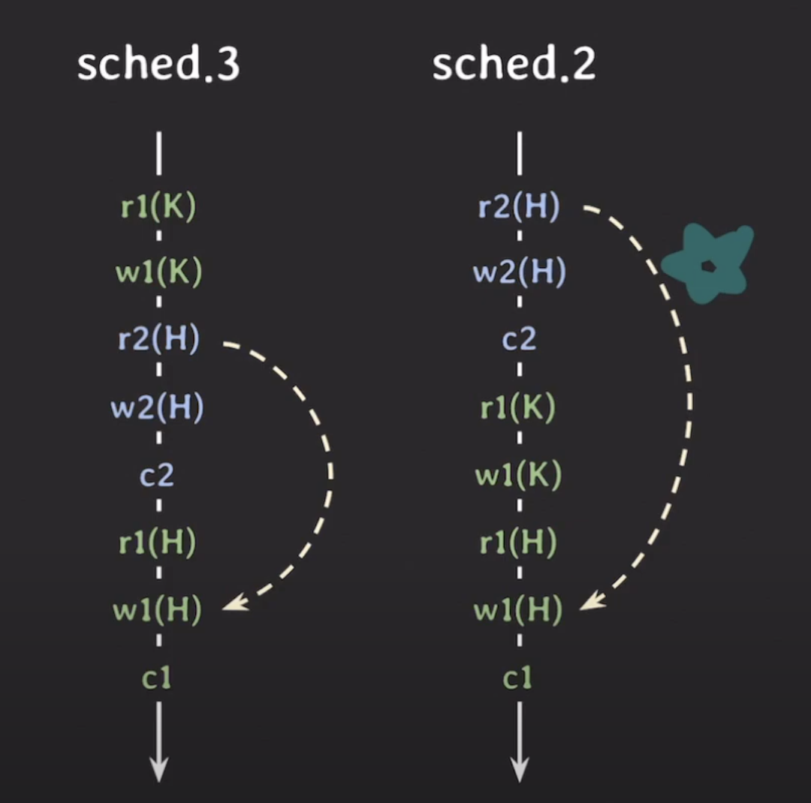

# Concurrency control : schedule, serializability

# Schedule
- 각 transaction들은 여러 operation으로 구성되어있음
- transaction들의 operation 실행 순서를 쭉 나열한 것을 schedule이라고 함
	- 여러 트랜잭션은 순서대로 실행될수도 있고, operation 순서가 섞여서 실행될 수도 있음
	- 각 transaction 내의 operatione들의 순서는 바뀌지 않음 (트랜잭션 간의 오퍼레이션 실행 순서는 바뀔 수 있음)

## Serial schedule
### 의미
- transaction의 operation 실행 순서가 섞이지 않고, 한 트랜잭션 먼저 수행한 뒤 다른 트랜잭션이 수행되는 것을 의미함
- transaction들이 겹치지 않고 한 번에 하나씩 실행되는 schedule
### 성능
- 한번에 하나의 트랜잭션만 실행하기 때문에 동시성이 없고, I/O작업을 하는 동안 CPU는 놀고 있는 상태가 됨
- operation 순서로 인해 값이 꼬이는 경우는 없음
- 동시성이 없어서 좋은 성능을 낼 수 없고, 현실적으로 사용할 수 없음(여러 트랜잭션을 빠르게 처리할 수 없음)

## Nonserial schedule
### 의미
- 트랜잭션들이 겹쳐서(interleaving) 실행되는 schedule
### 성능
- 트랜잭션들이 겹쳐서 실행하기 떄문에 동시성이 있음. CPU가 놀고 있는 시간이 줄어듦
- operation 순서가 섞여서 값이 꼬이는 경우 발생 가능
- 동시성 덕분에 좋은 성능을 낼 수 있지만 짧음. 같은 시간에 더 많은 트랜잭션 처리 가능
### 문제점
- 어떤 형태로 겹처서 실행되는지에 따라 의도하지 않은 결과가 발생할 수 잇음

- Nonserial schedule로 빠르게 하되, 의도지 않은 결과가 발생하지 않는 방법이 필요함. 그것을 위해서 schedule이 무엇인지에 대해 정의할 필요가 있음

  

# Conflict serializable
- serial schedule과 conflict equivalent인 경우를 의미함
- serial schedule과 conflict equivalent이 같기 때문에 의도하지 않은 결과가 발생하지 않으며, 동시성이 일어나기 때문에 더 빠름 (nonserial schedule이더라도 conflict serializable할 수 있음)
- conflict serializable한 nonserial schedule을 허용하면 좋을 듯!
## 구현
- 여러 트랜잭션을 동시에 실행해도 schedule이 Conflict serializable하도록 보장하는 프로토콜을 적용함
- concurrency control이 serializable하게 만들어줌. ACID중 Isolation이 이것을 가능하게 해줌

## Conflict (of two operations)
### 의미
- 두개 이상의 트랜잭션에서 서로 영향을 줘서 전체 결과에 영향을 주는 operation들
- conflict operation은 순서가 바뀌면 결과도 바뀜

### conflict이기 위한 조건
1. 서로 다른 transaction 소속
2. 같은 데이터에 접근
3. 최소 하나는 write operation

### conflict 종류
- read-write conflict
- write-write conflict

## Conflict equivalent (for two schedules)
### 조건
1. 두 schedule은 같은 transaction들을 가짐
2. 어떤 conflicting operations의 순서도 양쪽 schedule 모두 동일함
	- 한 schedule의 conflict에서 operation들의 순서가, 다른 schedule에서도 동일한 순서로 실행됨
