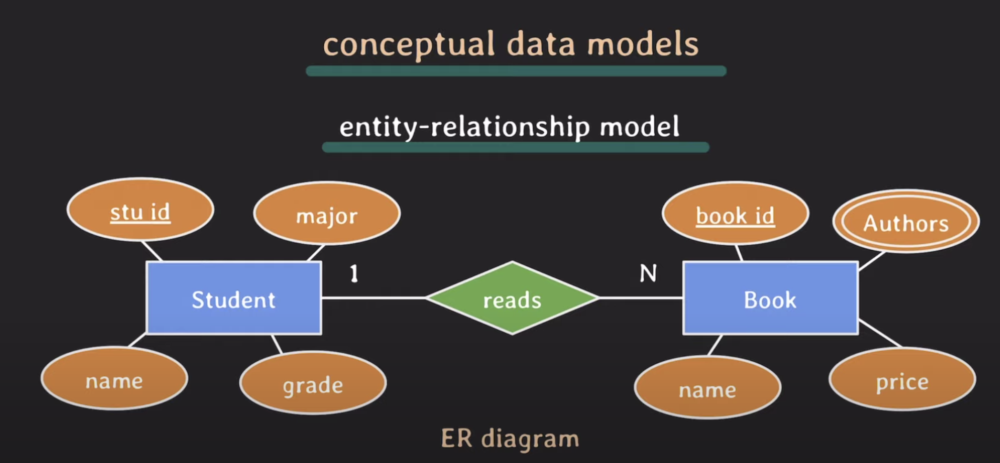
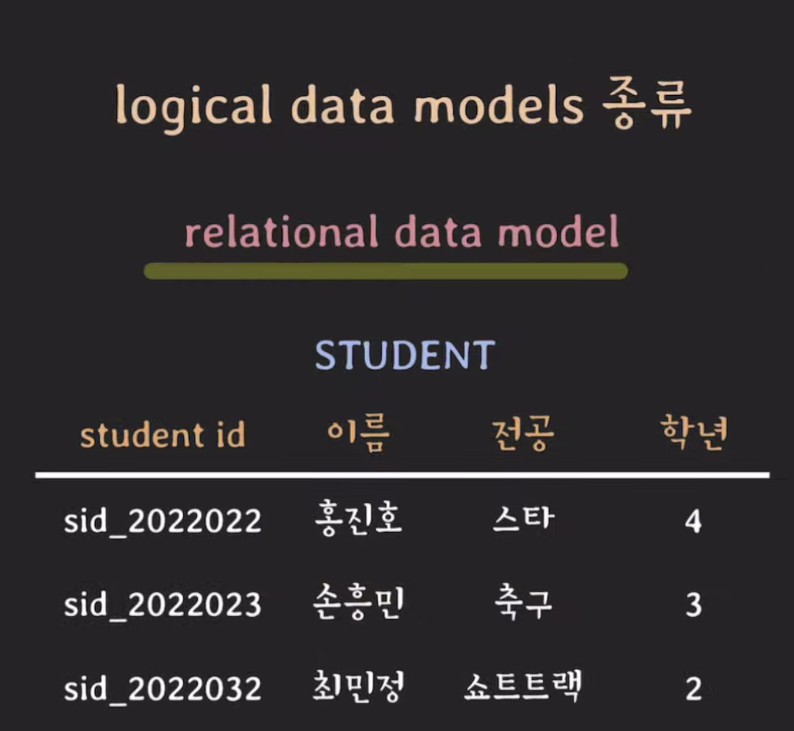
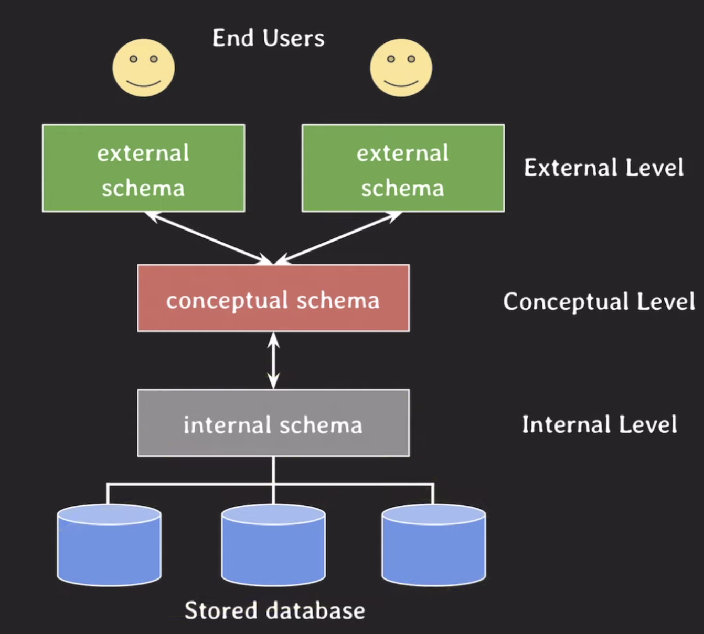

# DB & DBMS & DB system

## database(DB)
### 의미
- <u>전자적으로(electronically)</u> 저장되고 사용되는 <u>관련있는(related)</u> 데이터들의 <u>조직화된</u> 집함(organized collection)
- 관련있는 데이터 : 같은 출처, 같은 목적, 같은 서비스 안에서 생성되는 데이터
- 조직화된 집합 : 잘 찾고 중복 없애고 데이터 불일치 없애기 위해서 잘 조직화 하는것
- 전자적 사용 : 데이터가 컴퓨터에 저장되고 사용되는 것

## DBMS
### 의미
- databse management systems
- 사용자에게 DB를 정의하고 만들고 관리하는 기능을 제공하는 소프트웨어 시스템
- 예 : mysql, PostgreSQL, ORACLE, ...
- DB를 정의하다보면 부가적인 데이터가 발생함 -> 이를 metadata라고 함
### metadata
- data about data : 데이터를 설명하기 위한 데이터
- database를 정의하거나 기술하는(descriptive) 데이터
- catalog라고도 부르고, metadata가 저장되는 곳을 catalog라고 부르기도 함
- 데이터 유형, 구조, 제약조건, 보안, 저장, 인덱스, 사용자 그룹 등을 저장함
- 이 metadata도 DBMS에 저장되어 관리됨

## database system
### 의미
- database + DBMS + 연관된 applications
- 줄여서 그냥 database라고도 부름
### 처리 과정
1. 사용자(프로그래머)가 application program으로 query를 씀
2. DBMS software에서 그 쿼리를 받아서, 쿼리의 의미를 분석함
3. DBMS software에서 요청 처리
	- 요청 처리를 위한 부가적인 정보 확인(metadata 등 확인)
	- 요청 받은 쿼리에 대해 데이터를 처리함
4. DBMS software에서 처리 결과를 application에게 돌려줌

  

# Data model
## 의미
- DB의 구조(structure)를 기술하는데 사용될 수 있는 개념들이 모인 집합
- 개념들을 바탕으로 데이터베이스의 구조를 <u>추상화해서</u> 표현할 수 있는 수단을 제공함
- 여러 종류의 종류가 있으며 추상화 수준과 DB구조화 방식이 조금씩 다름
- DB에서 읽고 쓰기 위한 기본적인 동작들(operations)도 포함함
## 분류
### conceptual (high-level) data model
- 일반 사용사들(비개발자도) 쉽게 이해할 수 있는 개념들로 이뤄진 모델
- 추상화 수준이 가장 높음
- 비즈니스 요구 사항을 추상화하여 기술할 때 사용
- 예) entity-relationship model
	

### logical (representational) data model
- 이해하기 어렵지 않으면서도 디테일하게 DB를 구조화할 수 있는 개념들을 제공함
- 데이터가 컴퓨터에 저장될 때의 구조와 크게 다르지 않게 DB 구조화를 가능하게 함
- 특정 DBMS나 특정 storage에 종속되지 않는 수준에서 DB를 구조화할 수 있는 모델
- 어느정도 추상화는 되어있으며, 백엔드 개발자가 많이 쓰는 영역
- 예1) relational data model
	
	- relation : 위 그림에서 table 자체를 relation이라고 부름
	- row : 데이터 각각을 의미
	- column : 데이터의 속성 (attribute)를 의미함
	- 이게 가장 많이 사용됨 (ORACLE, MySQL, MS SQL server)
- 예2) object data model
- 예3) object-relational data model (PostgreSQL)

### physical (low-level) data model
- 컴퓨터에 데이터가 어떻게 파일 형태로 저장되는지를 기술할 수 있는 수단을 제공
- 컴퓨터에 저장되는 형태와 가장 근접한 형태로 표현할 수 있는 데이터 모델
- data format, data orderings, access path(index) 등을 사용하여 실제 컴퓨터에 저장되는 것과 밀접하게 사용할 수 있음
- access path : 데이터 검색을 빠르게하기 위한 구조체 (예. index)

  

# schema & state
## database schema
- data model을 바탕으로 database의 구조를 기술한 것
- data model이 db구조를 모델링하는 방법을 제공하는 것이라면, 그 모델을 바탕으로 그 data base의 구조를 표현하고 기술하는 것
- database를 설계할 때 정해지며, 한 번 정해진 후에는 자주 바뀌지 않음
- database는 어떤 테이블을 가졌고, 각 테이블은 어떤 속성을 갖고 있는지를 표현함
## database state
- database에 있는 실제 데이터는 꽤 자주 바뀔 수 있음
- 특정 시점에 database에 있는 데이터를 database state 혹은 snapshot이라고 함 (데이터베이스 안에 있는 데이터는 계속 바뀌는데, 특정 시점에서의 데이터들을 의미함)
- 혹은 databse에 있는 현재 instances의 집합이라고도 함
## three-schema architecture
- database system을 구축하는 architecture 중의 하나 (많은 모델들이 이 아키텍처를 따라감)
- 목적 : user application으로 부터 물리적인 database를 분리시킴. 데이터를 CRUD하다보면, 물리 저장 공간에는 구조나 저장 위치가 바뀔 수 있음. 하지만 user가 보는 application에는 영향을 끼치지 않게 하기 위해서 이 구조를 사용함
- 세가지 level이 정의되어있고, 각 level은 schema가 정의되어 있음

- 안정적으로 database system을 운영하기 위해서 사용되는 아키텍처
- 각 레벨을 독립시켜서 어느 한 레벨에서의 변화가 상위 레벨에 영향을 주지 않기 위해서 사용함. 한 레벨에서 어떤 변화가 있으면, 다른 레이어와의 데이터 매핑정도만 바궈주면 됨
- 대부분의 DBMS가 three level을 완벽하게 혹은 명시적으로 나누지는 않음(external과 conceptual을 완벽히 나누는 것이 쉽지 않음)
- 각각의 스키마는 결국 data base 구조를 표현하는 것이지, 실제로 데이터가 존재하는 곳은 internal level
### internal schemas at internal level
- 물리적인 저장장치에 가장 가깝게 있음
- 물리적으로 데이터가 어떻게 저장되는지 physical data model을 통해 표현
- data stroage, data structure, access path 등 실제로 물리 저장 장치에 저장되는 내용을 기술함
### external schemas (or user views) at external (or view) level
- 실제 사용자가 바라보는 스키마 -> external views, user views라고도 불림
- 특정 유저들이 필요로 하는 데이터만 표현(유저마다 필요로하는 데이터가 다른데, 각각 필요로하는 것만 보여줌)
- 그 외에 알려줄 필요 없는 데이터는 숨김
- logical data model을 통해 표현됨
### conceptual schemas at conceptual level
- external schema를 통해 각각의 유저들에게 각각의 필요로하는 데이터를 주려고하다보니, internal schema에서 중복데이터 발생 및 동기화에러 발생 -> 이 문제를 해결하기 위해 생겨남
- 전체 database에 대한 구조를 기술 -> intenal schema를 한번 추상화시켜서 표현한 schema
- 물리적인 저장 구조에 대한 내용은 숨기며, 논리적으로 데이터베이스의 전체 구조를 표현함
- entity, data types, relationships, user operations, constraint에 집중해서 data base 구조를 표현함 것
- 이것도 logical data model을 통해서 표현됨

  

# database language
## data definition language (DDL)
- conceptual shcema를 정의하기 위해 사용되는 언어
- 때론 internal schema까지 정의하기도 함
## storage definition language (SDL)
- internal schema를 정의하는 용도로 사용되는 언어
- 요즘, 특히 RDBMS에서는 SDL이 거의 없고 파라미러를 통해서 internal schema를 설정함
## view definition language(VDL)
- external schemas를 정의하기 위해 사용되는 언어
- 대부분의 DBMS에서는 DDL이 VDL 역할까지 수행함(DDL이 VDL을 거의 모든 것을 커버하고 있음
## data manipulation language(DML)
- database에 있는 data를 활용하기 위한 언어
- data 추가, 삭제, 수정, 검색 등의 기능을 제공하는 언어
## 통합된 언어
- 오늘날의 DBMS는 DML, VDL, DDL이 통합된 언어로 존재함
- 예 : **SQL**(relational database language에서)

  

# 참고
- [유튜브 쉬운코드](https://youtu.be/aL0XXc1yGPs)
