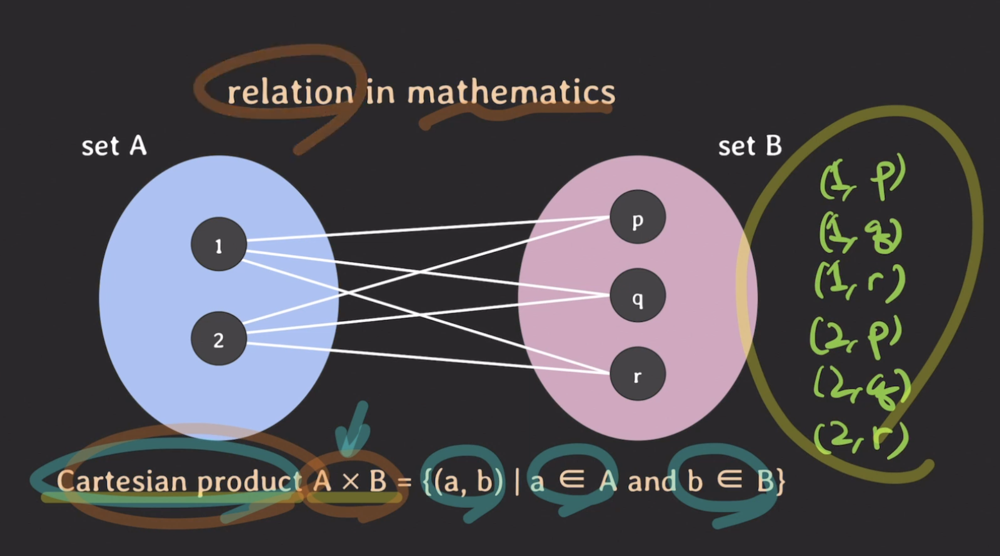
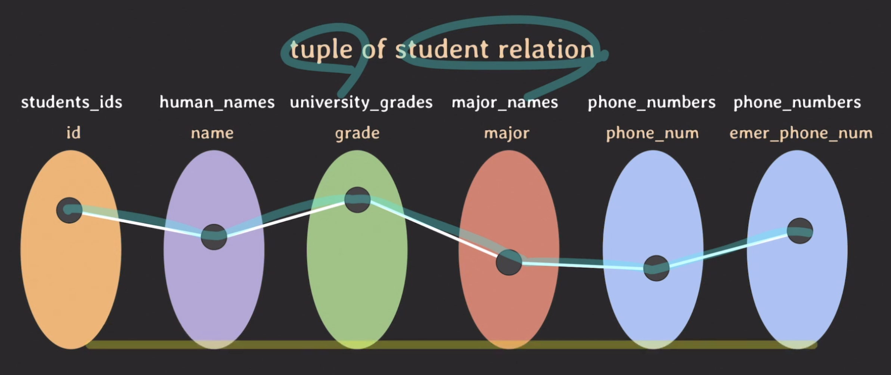
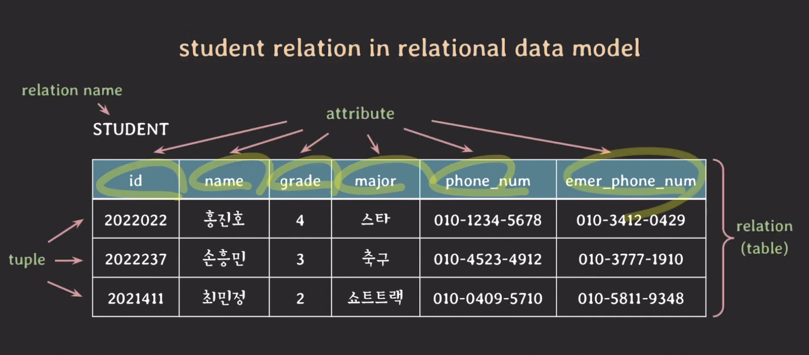

# [Database] Relational database

# Relation
> 수학에서 나온 개념으로, 이 단어를 이해하기 위해서 몇가지 배경지식이 필요함
## set
- 서로 다른 elements를 가지는 collection
- 하나의 set에서 elements의 순서는 중요하지 않음
- 예) {1, 3, 11, 4, 7}
## 수학에서의 relation
- 여러개의 set에서 요소를 골라서 만든 pair(list)들의 집합
- 카르테지안 프로덕트의(Cartesian product) 부분 집합
	- Cartesian product : 각 집합에서 요소 하나씩 뽑아서 쌍을 만드는데, 모든 경우의 수 쌍을 모아놓은 집합을 의미함
	
- 각각의 pair(list)를 튜플이라고 함 -> 튜플들의 집합(set of tuple)을 relation이라고 할 수 있음
## relational data model에서의 relation
- set : 도메인을 의미함. element의 집합. 도메인마다 이름을 수 있음
- element (or value) : set 안에 있는 한개의 값
- set들의 집합을 relation이라고 함
## relation 만드는 과정
1. 도메인 정의
	-  각 열에 어떤 값(element, value)이 들어올 것인지에 대한 정의
	```
	- studentes_ids : 학번 집합, 7자리 integer 정수
	- haman_names : 사람 이름 집합, 문자열
	- university_grades : 대학교 학년 집합, {1, 2, 3, 4}
	- major_names : 대학교에서 배우는 전공 이름 집합
	- phone_numbers : 핸드폰 번호 집합
	```
2. Attribute 정의
	- 각각의 도메인이 어떤 역할을 수행하는지, 그 역할의 이름을 정의하는 것
	- 한 도메인이 여러가지 목적을 위해 사용될 수 있음
	```
	- id <- studentes_ids
	- name <- haman_names
	- grade <- university_grades
	- major <- major_names
	- phone_num <- phone_numbers
	- emer_phone_num <- phone_-_numbers
	```
3. 각각의 도메인에 값이있을 것이고, 그 값들의 쌍으로 만들어진 튜플이 있음
4. 이를 가장 잘 표현할 수 있는 방법이 table. 그래서 relation이 table로 많이 표현됨
	- 수학적 그림으로 표현
		
	- table로 표현
		

## 용어 정리
|키워드|설명|
|---|---|
|domain|set of atomic values|
|domain name|domain 이름|
|attribute|domain이 relation에서 맡은 역할 이름|
|tuple|각 attribute의 값으로 이루어진 리스트. 일부 값은 NULL일 수 있음|
|relation|set of tuples (= table)|
|relation name|relation 이름|

## relation schema
- relation의 구조를 나타냄
- relation 이름과 attributes리스트로 표기됨
- 예) STUDENT(id, name, grade, major, phone_num, emer_phone_num)
- attributes와 관련된 constraints도 포함함 (위의 정의 예에서 시각적으로 표현되진 않지만, schema에 포함되는 내용임)

## degree of a relation
- relation schema에서 atrributes의 개수
- 예) STUDENT(id, name, grade, major, phone_num, emer_phone_num) -> **degree 6**

## relation의 다른 의미 : relation state
- table 전체를 relation이라고도 하는데,
- 특정 시점에서 tuples의 집합을 relation 이라고 하기도 함(데이터에 한정해서 의미함)

## relational database
- relational data mdoe에 기반하고 사용하여 구조화한 database
- relational database는 여러 개의 relation으로 구성됨
- relational database schema : relation schemas set + integrity constraints set

<br><br>

# relaion의 특징
- 중복된 tuple을 가질 수 없음 (relation은 set of tuple이기 때문에). tuple이 갖고 있는 모든 값이 다 동일한 또다른 tuple은 있을 수 없음
- relation의 tuple을 식별하기 위해 attribute의 부분 집합을 key로 설정함 (id라는 attribute를 둬서 각 튜플을 유니크하게 구분함)
- tuple간의 순서는 중요하지 않음. 순서가 바뀌어도 relation의 의미가 달라지거나 영향을 주지 않음
- 하나의 relation에서 attribute의 이름은 중복되지 않고, attribute의 순서는 중요하지 않음
- attribute는 atomic(원자적, 더이상 나눠질 수 없는)해야 함 (composite or multivalued attribute는 허용 안됨)

<br><br>

# NULL의 의미
- 값이 존재하지 않음
- 값이 존재하나 아직 그 값이 무엇인지 알지 모름
- 해당 사항과 관련이 없음

<br><br>

# Key
## superkey
- relation에서 tuples를 unique하게 식별할 수 있는 attributes set
- 유니크하게 식별할 수 있는 attributs set이면 어떤 묶음이든 가능함. id 하나만 해도 되고, 모든 attribute 전체를 superkey로 해도 됨
## candidate key
- superkey 중에 어느 한 attribute라도 제거하면 unique하게 tuple을 식별할 수 없는 것
- key, minimal superkey 라고도 함
- primary key가 될 수 있는 후보들
## primary key
- relation에서 tuples를 unique하게 식별하기 위해 선택된 candidate key
- 보통은 attribute 숫자가 더 적은 key를 선택함
## unique key
- primary key로 선택되지 못한 candidate keys
- alternate key
## foreign key
- 다른 relation의 PK(primary key)를 참조하는 attributes set

<br><br>

# Constraints
- 의미 : relational database의 relation들이 언제나 항상 지켜줘야 하는 제약 사항
## 분류
### implicit constraints
- relational data model 자체가 가지는 constraints
- relation은 중복되는 tuple을 가질 수 없음
- relation 내에서는 같은 이름의 attribute를 가질 수 없음
### schema-based constraints
- 주로 DDL(sql 등)을 통해 schema에 직접 명시할 수 있는 constraints
- explicit constraints
## schema-based constraints 종류
### domain constraints
- attribute의 value는 항상 attribute의 domain에 속한 value여야 함
- domain에 설정한게 1~4 사이의 int라면, 알파벳이나 4초과 숫자를 value로 넣을 수 없음
### key constraints
- 서로 다른 tuple은 같은 value의 key를 가질 수 없음
- key는 unique해야 함
### NULL value constraints
- attribute가 NOT NULL로 명시됐다면 NULL을 값으로 가질 수 없음
- NOT NULL로 명시됐다면 그 attribute에는 값을 꼭 부여해줘야함
### entity integrity constraint
- primary key는 value에 NULL을 가질 수 없음
- primary key는 unique한 튜플을 식별하기 위해 사용하는 키인데, NULL이면 안되겠지!
### referential integrity constraint
- FK(foreign key)와 PK(primary key)는 도메인이 같아야하고
- PK에 없는 value를 FK가 가질 수 없음
## 위반하면?
- database system에서 에러(exception)를 반환함. 백엔드 어플리케이션은 에러 상황 따라 핸들링해주면 됨

<br><br>

## 참고
[유튜브 쉬운코드](https://youtu.be/aL0XXc1yGPs)
