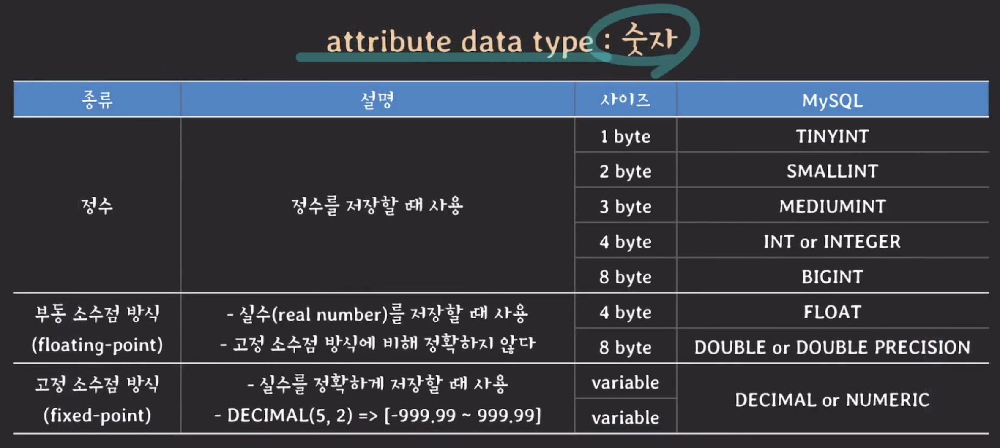
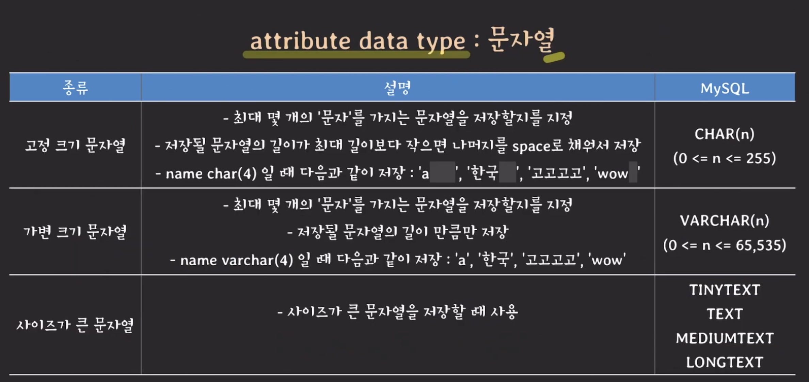
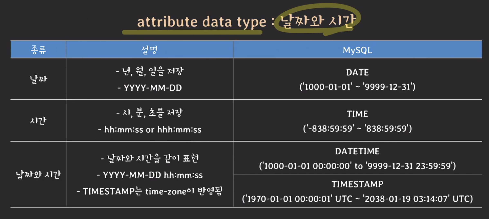

# SQL Table, constraints

## \[Database] SQL의 기본 개념과 DB구조를 정의하는 SQL 기본 문법

## SQL 기본 개념

### 의미

* Structured Query Language
* 현업에서 쓰이는 relational DBMS의 표준언어
* 종합적인 database 언어 : DDL + DML + VDL

\


### 주요 용어

#### relational data model 와 비교

| relational data model |   SQL  |
| :-------------------: | :----: |
|        relation       |  table |
|       attribute       | column |
|         tuple         |   row  |
|         domain        | domain |

* relational data model 용어와 SQL 용어를 구분하지 않고 혼용해서 사용하기도 함

#### SQL에서 relation이란?

* multiset of tuples
* relational data model와는 다르게 중복된 tuple을 허용함

### SQL과 RDBMS

* SQL은 RDBMS의 표준 언어이지만, 실제 구현에 강제가 없기 때문애, RDBMS마다 제공하는 SQL의 스펙이나 문법이 조금씩 다름

\
\


## 예제를 통한 SQL로 DB 정의하기

> IT회사 관련 RDB 만들기\
> 부서, 사원, 프로젝트 관련 정보들을 저장할 수 있는 관계형 데이터베이스\
> MySQL(InnoDB)를 사용함

\


### database 정의하기

*   database의 목록 보기

    ```SQL
    SHOW DATABASES;
    ```
*   database 만들기

    ```SQL
    CREATE DATABASE company;
    ```
*   현재 사용하고 있는(선택된) 데이터베이스확인

    ```SQL
    SELECT database();
    ```
*   데이터베이스 사용

    ```SQL
    USE company;
    ```
*   데이터베이스 삭제

    ```SQL
    DROP DATABASE company;
    ```

#### DATABASE vs SCHEMA

* MySQL에서는 DATABASE와 SCHEMA가 같은 뜻을 의미함
* `CREATE DATABASE companey` = `CREATE SCHEMA company`
* 다른 RDBMS에서는 의미가 다르게 쓰임 (PostgreSQL에서는 SCHEMA가 DATABASE의 namespace를 의미함)

\


### table 만들기

> IT회사 RDB 만들기\
> 부서, 사원, 프로젝트 관련 정보들을 저장할 수 있는 관계형 데이터베이스 만들기

#### SCHEMA 정의


#### table 생성 쿼리

* CREATE TABLE < table\_name >
* 괄호() 안에서 콤마, 로 구분하여 attribute를 설정해줌
* attribute는 < 이름 > < 데이터 타입 > < constraints(제약사항) > 을 순서대로 씀
* 괄호()가 끝나면 세미콜론; 으로 마무리함

**DEPARTMENT table**

````
``` SQL
CREATE TABLE DEPARTMENT (
	id INT PRIMARY KEY,
	name VARCHAR(20) NOT NULL UNIQUE,
	leader_id INT
);
```
````

**EMPLOYEE table**

````
``` SQL
CREATE TABLE EMPLOYEE (
	id INT PRIMARY KEY,
	name VARCHAR(30) NOT NULL,
	birth_date DATE,
	sex CHAR(1) CHECK (sex in ('M', 'F')),
	position VARCHAR910),
	salary INT DEFAULT 50000000,
	dept_id INT,
	FOREIGN KEY (dept_id) references DEPARTMENT(id)
		on delete SET NULL on update CASCADE,
	CHECK (salary >= 50000000)
);
```
````

**PROJECT table**

````
``` SQL
CREATE TABLE PROJECT (
	id INT PRIMARY KEY,
	name VARCHAR(20) NOT NULL UNIQUE,
	leader_id INT,
	start_date DATE,
	end_date DATE,
	FOREIGN KEY(leader_id) references EMPLOYEE(id)
		on delete SET NULL on update CASCADE,
	CHECK (start_date < end_date)
);
```
````

**WORKS\_ON table**

````
``` SQL
CREATE TABLE WORKS_ON (
	empl_id INT,
	proj_id INT,
	PRIMARY KEY (empl_id, proj_id),
	FOREIGN KEY (empl_id) references EMPLOYEE(id)
		on delete CASCADE on update CASCADE,
	FOREIGN KEY (proj_id) references EMPLOYEE(id)
		on delete CASCADE on update CASCADE,
);
```
````

\
\


## Atrribute 정의

### Data type

> RDBMS마다 조금씩 다름. 사용하는 RDBMS에 따라 docs 확인하기

#### 숫자

<figure><figcaption></figcaption></figure>

#### 문자열

<figure><figcaption></figcaption></figure>

#### 시간

<figure><figcaption></figcaption></figure>

#### 기타


\
\


## Constraints

### Key constraints

#### PRIMARY KEY

* table의 tuple을 식별하기 위해 사용
* 하나 이상의 attribute(s)로 구성됨
* 중복된 값을 가질 수 없으며, NULL 도 가질 수 없음 (UNIQUE NOT NULL)
* 선언 방법
  *   하나일 때

      ```SQL
      CREATE TABLE DEPARTMENT (
      	id INT PRIMARY KEY,
      	...
      );
      ```
  *   하나 이상일 때

      ```SQL
      CREATE TABLE DEPARTMENT (
      	id INT,
      	name VARCHAR(20),
      	...,
      	PRIMARY KEY (id, name);
      );
      ```

#### UNIQUE

* 해당 atrribute는 중복값을 가질 수 없음
* 단, NULL은 중복을 허용할 수도 있음(RDBMS 마다 다름)
* 선언 방법 : PRIMARY KEY 처럼 하나일떄랑 하나 이상일 때 방법 둘 다 할 수 있음
* NOT NULL과 같이 쓰는 경우가 많음

#### NOT NULL

* 해당 atrribute는 NULL을 값으로 가질 수 없음
* 선언 방법 : attribute level로만 선언 가능.

\


### DEFAULT

* 기본 값을 설정함
* 튜플을 생성할 때 해당 attribute에 값을 설정하지 않으면, 기본값으로 설정됨

\


### CHECK constraint

* attribute의 값을 제한하고 싶을 때 사용
* 최솟값, 최대값 등을 설정할 수 있음
* 선언 방법
  *   하나일 때 : attribute line에서 설정 가능

      ```SQL
      CREATE TABLE EMPLOYEE (
      	...
      	age INT CHECK (age >= 20),
      	...
      );
      ```
  *   하나 이상일 때 : 맨 밑에서 묶어서 설정 가능

      ```SQL
      CREATE TABLE PROJECT (
      	start_date DATE,
      	end_date DATE,
      	...,
      	CHECK (start_date < end_date)
      );
      ```

\


### FOREIGN KEY(Referential integrity constraint)

* 다른 table의 primary key나 unique key를 참조할 때 사용
* FK의 값은 참조하는 PK(or unique key)에 있는 값이어야 함
*   선언 방법

    ```SQL
    CREATE TABLE EMPLOYEE (
    	...
    	dept_id INT,
    	FOREIGN KEY (dept_id)
    		references DEPARTMENT(id)
    		on delete reference_option (삭제할 때 이 옵션 적용)
    		on update reference_option (수정할 떄 이 옵션 적용)
    );
    ```
*   reference\_option(sql 표준 스펙)

    | option      | 설명                                                                        |
    | ----------- | ------------------------------------------------------------------------- |
    | CASCADE     | 참조 값의 삭제/변경을 그대로 반영(삭제되면 튜플이 통채로 삭제되고, 수정되면 같이 수정됨                        |
    | SET NULL    | 참조 값이 삭제/변경 시 NULL로 변경                                                    |
    | RESTRICT    | 참조 값이 삭제/변경되는 것을 금지                                                       |
    | NO ACTION   | RESTRICT와 유사(한 트랜젝션 내에서는 변경되는 것은 인정, 트랜젝션 끝났을 때 변경된 상태로 끝나면 RESTRICT처럼 동작 |
    | SET DEFAULT | 참조 값이 삭제/변경 시 default 값으로 변경                                              |

    * MySQL에서는 위 세개만 지원함
    * PostgreSQL는 5개 다 지원함

\


### constraint 이름 명시하기

*   위반했을 때 설정한 이름을 출력해줌. 직관적으로 어떤 constraint인지 알려줄 수 있어서 좋음

    ```SQL
    CREATE TABLE TEST (
    	age INT CONSTRAINT age_over_20 CHECK (age > 20)
    );
    ```

    * 출력 : `Check constraint 'age_over_20' is violated`
    * 설정 안하면 : `Check constraint 'test_chk_1' is violated`

\
\


## schema 변경하기 ALTER TABLE

### 문법

* `ALTER TABLE <테이블명> <뭐해줄지>`
* 사용하려는 RDBMS의 문서를 참고할 것

```SQL
ALTER TABLE department ADD FOREGIN KEY (leader_id)
REFERENCES employee(id)
on update CASCADE
on delete SET NULL;
```

\
\


## 테이블 삭제

### 문법

* `DROP TABLE <테이블 명>`
* `DROP TABLE table_name`

\
\


### 주의사항

* 이미 서비스 중인 table의 schema를 변경하는 것이라면, 변경 작업 때문에 서비스의 백엔드에 영향이 없을지 충분히 검토한 후에 변경하는 것이 중요
* 만들려는 서비스의 스펙과 데이터 일관성, 편의성, 확정성 등을 종합적으로 고려하여 DB 스키마를 적절하게 정의하는 것이 중요. SQL문을 무턱대로 막 설계하다간 큰코다쳐\~

\
\


## 참고

* [유튜브 쉬운코드](https://youtu.be/aL0XXc1yGPs)
