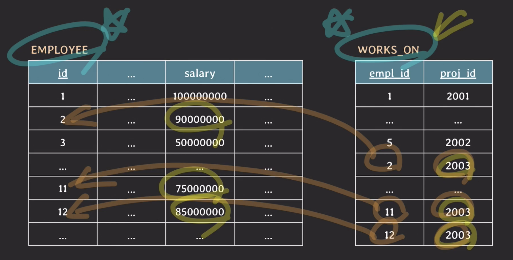

# [Database] SQL의 SQL을 사용해서 데이터를 추가, 수정, 삭제하기

# 데이터 추가하기 (insert)
## 문법
- 테이블이 어떤 attribute들로 어떤 constraint가 설정되어있는지 확인하고, 그에 맞춰서 데이터를 넣어줄 수 있음
- value를 넣을 땐, table을 만들 때 attribute를 정의했던 순서대로 넣어야 함
- 모든 attribute에 대응하는 값을 넣어줘야 함
- constraint에 맞지 않거나, value가 설정되지 않으면 에러가 발생함 (에러 메시지를 확인하고 다시 처리해주면 됨)
- `INSERT INTO <테이블명> VALUES (attribute 목록에 대응되는 값들);`
	``` SQL
	INSERT INTO employee
	VALUES (1, 'MESSI', '1987-02-01', 'M', 'DEV_BACK', 1000000000, null);
	```
## attribute를 지정한 insert
- 원하는 attribute에 대해서만, 원하는 순서로 넣어줄 수 있음
- `INSERT INTO <테이블명> (attribute 목록) VALUES (attribute 목록에 대응되는 값들);`
	``` 
	INSERT INTO employee (name, birth_date, sex, position, id)
	VALUES ('JENNY', '2000-10-12', 'F', 'DEV_BACK', 3);
	```
- attribute를 지정하지 않으면 전체 attribute를 table 생성 때 지정한 순서대로 넣어야 함
## 여러개의 튜플(row)을 넣고 싶을 때
- VALUES 뒤의 괄호()를 콤마, 로 구분해서 여러개 설정함. 마지막 () 뒤엔 콤마가 아니라 ; 로 마침
- `INSERT INTO <테이블명> (attribute 목록) VALUES (값들1),(값들2),..., (값들n);`
	``` SQL
	INSERT INTO department VALUES
	(1001, 'headquarter', 4),
	(1002, 'HR', 6),
	(1003, 'development', 1),
	(1004, 'design', 3),
	(1005, 'product', 13);
	```

<br><br>

# 테이블에서 데이터 조회하기 (select)
## 문법
- `SELECT <조회할 attribute> FROM <테이블 명>`
- 조회할 attribute
	- *을 쓰면 하면 전체가 지정됨
	- attribute1, attribute2, attribute3, ... 이런식으로 여러개 지정해줄 수 있음
	- 순서 상관 없음
	``` SQL
	SELECT * FROM department
	```

# 데이블에서 데이터 수정하기 (update)
## 문법
- `UPDATE <테이블명> SET <수정할 attribute> = <새로운 값> [WHERE <바꿀 대상이 되는 row의 조건>]`
- `UPDATE table_name(s) SET attribute = value [, attribute = value, ...] [WHERE condition(s)];`
- WHERE가 없다면 테이블의 전체 row를 대상으로 update함
	``` SQL
	UPDATE employee SET dept_id = 1003 WHERE id = 1;
	```
	-> id가 1인 row의 dept_id를 1003으로 바꾼다.

## 새로운 값에 대해 연산 가능
- 예) 특정 조건의 사람들의 연봉을 2배 인상
	``` SQL
	UPDATE employee
	SET salary = salary * 2
	WHERE dept_id = 1003;
	```

## 두개의 테이블을 참조한 조건절
- 2003번 프로젝트에 참여중인 직원들의 연봉을 2배 인상

	``` SQL
	UPDATE employee, works_on
	SET salary = salary * 2
	WHERE employee.id = works_on.empl_id and proj_id = 2003;
	```
	- `employee.id` 에서 .과 그 앞의 테이블을 지워줘도 됨. 단, attribute 이름이 겹치면 안됨
	- 테이블 이름 써주는게 더 직관적이니 써주는게 좋을듯 

# 데이터 삭제하기 (delete)
## 문법
- `DELETE FROM table_name WHERE condition(s)`
- 예
	- John이 퇴사해서 테이블 내용을 삭제해야 함
	- John의 employee ID는 8이고, project 2001에 참여하고 있음
	``` SQL
	DELETE FROM employee WHERE id = 8;
	```
	- project table은 FK에 대해 delete될 때 CASCADE로 설정돼있어서, John이 해당된 row는 다 삭제됨
## WHERE 절이 없다면
- 모든 튜플(row)이 다 삭제됨
- 테이블은 남아 있음

# 조건절 WHERE
## 문법
- 등호, 부등호를 사용할 수 있음
- and와 or는 조건 사이에 and, or 로 써줌
- != 랑 <> 는 동일한 의미
- 예) `DELETE FROME works_on WHERE impl_id = 5 and proj_id = 2002;`

<br><br>

# 참고
- [유튜브 쉬운코드](https://youtu.be/aL0XXc1yGPs)
