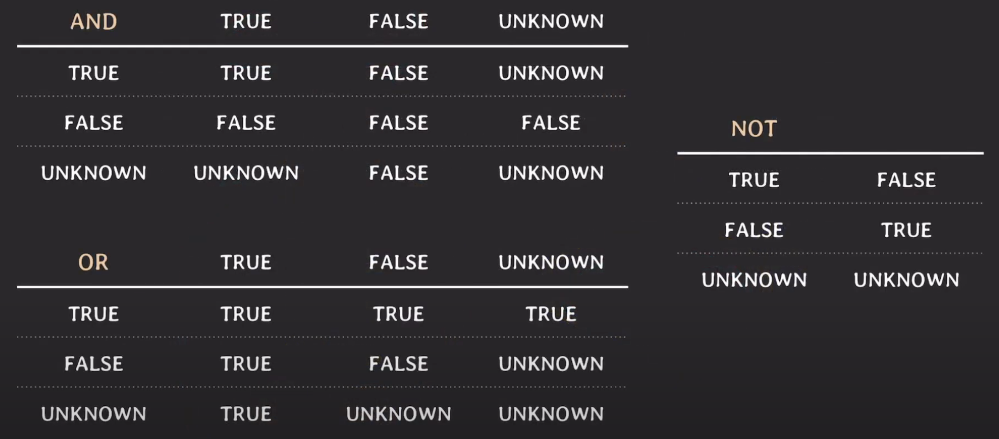

# [Database] SQL에서 NULL의 의미와 NULL에 대한 연산

## NULL의 의미
> 아래 세가지의 의미가 있는데, 이 세가지 의미 모두를 NULL 하나로 표현해줌
1. unknown
	- 아직 알려지지 않음
	- 예) 생일이 있을 건데, 생일이 언제인지 모름
2. unabailable or withheld
	- 정보는 있지만 이용할 수 없음
3. not applicable
	- 해당사항이 아님, 적용사항이 없음

## 특징
- 서로 다른 튜플이 같은 attribute에 대해 NULL을 갖고 있다고 할 때, 둘의 상태(값)가 같다고 할 수 없음

## 연산
1. `=`
	- 값의 동일성을 확인하는 연산자인데, NULL은 값이 아니라서 원하는 결과를 가져올 수 없음 
	- `WHERE birth_date = NULL` 으로 SELECT 해도, birth_date에 NULL이 들어가있는 튜플을 불러오진 못함
	- `WHERE birth_date IS NULL`을 사용해야 함

  

# three-valued logic
> NULL과 비교연산 했을 때, 나오는 결과
## UNKNOWN으로 처리
	- SQL에서 NULL과 비교 연산을 하게 되면, `UNKNOWN`을 결과로 반환함
	- TRUE 일수도 있고 FALSE 일 수도 있다는 의미
	- NULL은 값이 없는 걸수도 있고, 값을 아직 모르는 것일 수도 있으니까
	- three-valued logic : 비교/논리 연산의 결과로 TRUE, FALSE, UNKNOWN을 가짐
	- NULL과 NULL을 비교해도 UNKNOWN의 결과가 나옴

## 논리 연산
> 논리 연산에서 어떤 결과를 가져오는지 생각해보기 
> NULL은 어떤 값일지 아직 모르니까 이 값일 수도 있고 저 값일 수도 있다고 생각하면 됨

## WHERE 절 에서의 NULL 비교/논리연산
- where절에서는 condition(s)의 결과가 TRUE인 tuple(s)만 선택됨
- 결과가 FALSE 이거나 UNKNOWN 이면 해당 tuple은 선택되지 않음

## NOT IN 사용시 주의 사항
- `v NOT IN (v1, v2, v3)` 일 때, `v != v1 AND v != v2 AND v != v3` 와 같은 의미
- 만약 v1 중에 하나가 NULL이라면? -> FALSE or UNKNOWN 이 나올 거야. TRUE는 절대 나올 수 없음
- v 가 NULL 이라면 결과는 UNKNOWN
- WHERE 절은 TRUE인 것만 반환함
### 해결 방법
- NOT NULL constraint 로 설정
- NOT EXISTS로 바꿔서 써주기
- NOT IN의 조건(서브쿼리 등)에 NULL 이 포함되지 않게 AND __ IS NOT NULL 을 넣어줌

  

# 참고
- [유튜브 쉬운코드](https://youtu.be/y_7rOoOodCY)
