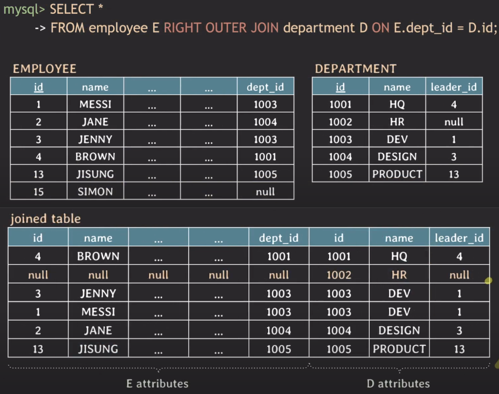
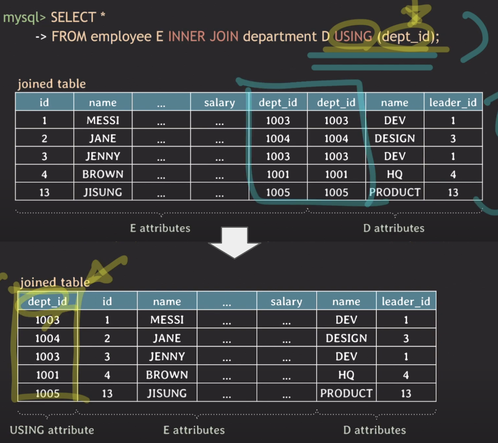

# [Database] SQL에서 JOIN

# SQL에게 JOIN이란?
## 의미
- 두 개 이상의 table 들에 있는 데이터를 한 번에 조회하는 것
- 여러 종류의 JOIN이 존재함

<br><br>

# implicit join vs explicit join
## implicit join
- from 절에서는 table들만 나열하고, where 절에 join condition을 명시하는 방식
- old-style join syntax 임
- where 절에 selection condition과 join condition이 같이 있기 때문에 가독성이 떨어지고, 복잡함 join 쿼리를 작성하다보면 실수 할 수 있음
- WHERE 절에서 join condition 사용 예시
	``` SQL
	SELECT D.name
	FROM employee AS E, department AS D
	WHERE E.id = 1 and E.dept_id = D.id;
	```
	- `E.dept_id = D.id` 가 join condition에 해당됨
	- 두개의 테이블을 참조해서 결과를 갖고오게 됨

## explicit join
- from 절에 JOIN 키워드가 함께 joined table들을 명시하는 방식
- from절에서 ON 뒤에 join condition이 명시됨
- 가독성이 좋아서 복잡한 join 쿼리 작성 중에 유리함
	``` SQL
	SELECT D.name
	FROM employee AS E JOIN department AS D ON E.dept_id = D.id
	WHERE E.id = 1;
	```
	- FROM절에서 employee table이 department table에 E.dept_id = D.id의 조건으로 JOIN을 한다. 

<br><br>

# Inner join vs Outer join
## inner join
- 그냥 JOIN하면 앞에 INNER가 생략된 것임
- 두 table에서 join condition을 만족하는 tuple들로 result table가 만들어짐
- join condition에 매칭되지 않으면 result table에 포함되진 않음
- join condition에서 null 값을 가지는 tuple은 result table에 포함되지 않음
- join condition에서는 =, <, >, != 등 여러 비교 연산자 사용 가능
- `FROM table1 [INNER] JOIN table2 ON join_condition`
	- table1이 table2에 join 함
- 결과는 table1의 attribute가 왼쪽에, table2의 attribute가 오른쪽에 나옴
	``` SQL
	SELCET *
	FROM employee E INNER JOIN department D ON E.dept_id = D.id;
	```

## outer join
- 두 table에서 join condition을 만족하지 않는 tuple들도 result table에 포함하는 join
- join condition에서는 =, <, >, != 등 여러 비교 연산자 사용 가능
### 종류
- `FROM table1 LEFT [OUTER] JOIN table2 ON join_condition`
	- 왼쪽 테이블(table1)에서 NULL을 갖는 tuple도 결과에 포함시켜줌. 단, 오른쪽 테이블(table2)에 있는 attribute는 다 NULL로 설정되어 출력됨
- `FROM table1 RIGHT [OUTER] JOIN table2 ON join_condition`
	- 오른쪽 테이블(table2)에서 NULL을 갖는 tuple도 결과에 포함시켜줌. 단, 왼쪽 테이블(table1)에 있는 attribute는 다 NULL로 설정됨
- `FROM table1 FULL [OUTER] JOIN table2 ON join_condition`
	- mysql 에서는 지원을 안함
	- 왼쪽 테이블(table1)과 오른쪽 테이블(table2)에서 NULL을 갖는 tuple도 결과에 포함시켜줌.
- 예시) outer join
	


<br><br>

# equi join
## 의미
- join condition에서 equality 연산자(=)를 사용하는 JOIN을 의미함
- 위에서 `E.dept_id = D.id`를 조건으로 했던 JOIN들이 이에 해당함
## equi join에 대한 두가지 시각
- inner join, outer join에 상관 없이 = 를 사용한 join이라면 모두 equi join으로 보는 경우
- inner join으로 한정해서 = 를 사용한 경우에 equi join으로 보는 경우

<br><br>

# using
## 의미
- 같은 이름의 attribute에 대해 = 연산을 통해 join할 때, 결과 table에 해당 attribute가 중복으로 쓰임. 그리고 ON 뒤에 `D.dept_id = E.dept_id` 처럼 dept_id를 두번이나 써줘야 함
- 그래서 결과 table에 한번만 표기되고, join condition을 간단하게 써주기 위한 방법이 `using`
- 두 table이 equi join 할 때, join 하는 attribute의 이름이 같다면, USING으로 간단하게 작성할 수 있음
- 이 때 같은 이름의 attribute는 result table에서 맨 앞에 한번만 표시됨
- 예시
	``` SQL
	FROM table1 [INNER] JOIN table2 USING (attribute(s));
	FROM table1 LEFT [OUTER] JOIN table2 USING (attribute(s));
	FROM table1 RIGHT [OUTER] JOIN table2 USING (attribute(s));
	FROM table1 FULL [OUTER] JOIN table2 USING (attribute(s));
	```
	

<br><br>

# natural join
## 의미
- 두 table에서 같은 이름을 가지는 모든 attribute pair에 대해서 equi join을 수행
- join condition을 따로 명시하지 않음. 모든 attribute pair에 대해서 = 연산을 하기 때문에.
- attribute name이 고유할 건 고유하게, 겹치게 할 건 겹치게 잘 설정돼있어야 함
	``` SQL
	FROM table1 NATURAL [INNER] JOIN table2;
	FROM table1 NATURAL LEFT [OUTER] JOIN table2;
	FROM table1 NATURAL RIGHT [OUTER] JOIN table2;
	FROM table1 NATURAL FULL [OUTER] JOIN table2;
	```

<br><br>

# cross join
- 두 table의 tuple pair로 만들 수 있는 모든 조합(= Cartesian product)을 result로 반환함
- join condition이 없음
- 표현 방법
	- implicit cross join : `FROM table1, table2`
	- explicit cross join : `FROM table1 CROSS JOIN table2`

<br><br>

# self join
- table이 자기 자신에게 join 할 수 있음

<br><br>

# 참고
- [유튜브 쉬운코드](https://youtu.be/E-khvKjjVv4)
