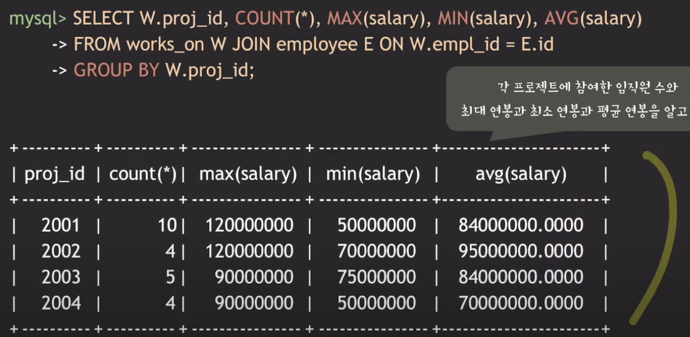

# [Database] SQL에서 GROUP BY, ORDER BY

# ODERR BY
## 의미
- 조회 결과를 특정 attribute(s)를 기준으로 정렬하여 가져오고 싶을 때 사용함
- default 정렬 방식은 오름차순(ASC)
- ASC : 오름차순 정렬
- DESC : 내림차순 정렬

## 사용 예시
- `SELECT <추출할 attributes> FROM <테이블 명> ORDER BY <정렬 기준 1 attribute> [ASC or DESC] [, <정렬 기준 2 attribute> [ASC or DESC]]`
- 임직원들의 정보를 연봉 순서대로 정렬해서 가져오기
    ``` SQL
    // 오름차순
    SELECT * FROM employee ORDER BY salary; 

    // 내림차순
    SELECT * FROM employee ORDER BY salary DESC;

    // 여러 기준 (부서 오름차순 정렬 후 연봉 내림차순)
    SELECT * FROM employee ORDER BY dept_id ASC, salary DESC;
    ```

# aggregate function
## 의미
- 여러 tuple들의 정보를 요약해서 하나의 값으로 추출하는 함수
- COUNT, SUM, MAX, MIN, AVG
- 주로 관심있는 attribute에 사용되며, NULL 값들은 제외하고 요약 값을 추출함
- SELECT의 결과물로 나오는 것이기 때문에 SELECT 절에 포함시켜야 함

## 사용 예시
- `SELECT COUNT (<attribute 이름>) FROM <테이블 명>;`
- `<attribute 이름>` 에 *를 넣으면 전체 튜플을 대상으로 한다는 뜻. 특정 attribute를 넣으면 NULL 값은 제외하고 연산하게 됨
- 임직원 수를 알고 싶을 때
    ``` SQL
    SELECT COUNT (*) FROM employee;
    ```
- 프로젝트 2002에 참여한 임직원 수와 최대 연봉과 최소 연봉과 평균 연봉 구하기
    ``` SQL
    SELECT COUNT(*), MAX(salary), MIN(salary), AVG(salary)
    FROM works_on W JOIN employee E ON W.empl_id = E.id
    WHERE W.proj_id = 2002;
    ```

# GROUP BY
## 의미
- 관심 있는 attribute(s) 기준으로 그룹을 나눠서 그룹별로 aggregate funcion을 적용하고 싶을 때 사용함
- grouping attribute(s) : 그룹을 나누는 기준이 되는 attribute. 여러개를 기준으로 그루핑 할 수 있음
- grouping attribute에 NULL 이 있을 경우, NULL 값을 갖는 tuple끼리 묶음

## 사용 예시
- 각 프로젝트에 참여한 임직원 수와 최대 연봉과 최소 연봉과 평균 연봉 구하기
    ``` SQL
    SELECT W.proj_id COUNT(*), MAX(salary), MIN(salary), AVG(salary)
    FROM works_on W JOIN employee E ON W.empl_id = E.id
    GROUP BY W.proj_id;
    ```
    
    - works_on 과 employee 를 JOIN 하고
    - proj_id 별로 그룹핑을 한 다음에
    - 그룹별로 proj_id, COUNT, MAX, MIN, AVG 를 구함

# HAVING
## 의미
- 그룹핑한 결과를 기준에 조건을 걸어서 그 조건에 부합하는 대상만 구하고 싶을 때 사용
- GROUP BY와 함께 사용
- aggregate function의 결과값을 바탕으로 그룹을 필터링하고 싶을 때 사용
- HAVING절에 명시된 조건을 만족하는 그룹만 결과에 포함

## 사용 예시
- 프로젝트 참여 인원이 7명 이상인 프로젝트들에 대해서 각 프로젝트에 참여한 임직원 수, 최대 연봉, 최소 연봉, 평균 연봉을 알고 싶다
    ``` SQL
    SELECT W.proj_id, COUNT(*), MAX(salary), MIN(salary), AVG(salary)
    FROM works_on W JOIN employee E ON W.empl_id = E.id
    GROUP BY W.proj_id
    HAVING COUNT(*) >= 7;
    ```

# 사용 예시
- 각 부서별 인원수를 인원 수가 많은 순서대로 정렬
    ``` SQL
    SELECT dept_id, COUNT(*) AS empl_count
    FROM employee
    GROUP BY dept_id
    ORDER BY empl_count DESC;
    ```

- 각 부서별-성별 인원수를 인원수가 많은 순서대로 정렬
    ``` SQL
    SELECT dept_id, sex, COUNT(*) AS empl_count
    FROM employee
    GROUP BY dept_id, sex
    ORDER BY empl_count DESC;
    ```

- 회사 전체 평균 연봉보다 평균 연봉이 적은 부서들의 평균 연봉을 알고 싶다
    ``` SQL
    SELECT dept_id, AVG(salary)
    FROM employee
    GROUP BY dept_id
    HAVING AVG(salary) < (
                SELECT AVG(salary) FROM employee
            );
    ```

- 각 프로젝트별로 프로젝트에 참여한 90년대생들의 수와 이들의 평균 연봉을 알고 싶다
    ``` SQL
    SELECT proj_id, COUNT(*), ROUND(AVG(salary), 0)
    FROM works_on W JOIN employee E ON W.empl_id = E.id
    WHERE E.birth_date BETWEEN '1990-01-01' AND '1999-12-31'
    GROUP BY W.proj_id
    ORDER BY W.proj_id;
    ```

- 프로젝트 참여 인원이 7명 이상인 프로젝트에 한정해서 각 프로젝트별로 프로젝트에 참여한 90년대생들의 수와 이들의 평균 연봉을 알고 싶다
    ``` SQL
    SELECT proj_id, COUNT(*), ROUND(AVG(salary), 0)
    FROM works_on W JOIN employee E ON W.empl_id = E.id
    WHERE E.birth_date BETWEEN '1990-01-01' AND '1999-12-31'
        AND W.proj_id IN (SELECT proj_id FROM works_on
                            GROUP BY proj_id HAVING COUNT(*) >= 7)
    GROUP BY W.proj_id
    ORDER BY W.proj_id;
    ```
    - GROUP BY 뒤에 HAVING COUNT(*) >= 7 로 하면 안됨.
    - 여기서의 COUNT는 프로젝트 참여 인원이 아니라, 프로젝트에 참여한 90년대생 인원이기 때문

# SELECT 로 조회하기 요약
- `SELECT attribute(s) or aggregate function(s)` : 관심있는 attribute나 aggregate를 뽑아올거다
- `FROM table(s)` : 조회할 table or JOIN한 table을 지정함
- `[WHERE condition(s)]` : 가져올 tuple을 조건을 통해서 필터링 함
- `[GROUP BY group attribute(s)]` : 튜플들을 그룹핑을 하고 싶을 때
- `[HAVING group condition(s)]` : 그룹핑 결과로 특정 그룹만 필터링 하고 싶을 때
- `[ORDER BY attribute(s)]` : 위의 결과를 정렬해서 가져오고 싶을 때
## SELECT의 개념적인 실행 순서
- 아래는 개념적인 순서일 뿐, 실제 실행 순서는 RDBMS의 구현에 따라 다름
- 6. `SELECT attribute(s) or aggregate function(s)`
- 1. `FROM table(s)`
- 2. `[WHERE condition(s)]`
- 3. `[GROUP BY group attribute(s)]`
- 4. `[HAVING group condition(s)]`
- 5. `[ORDER BY attribute(s)]`
