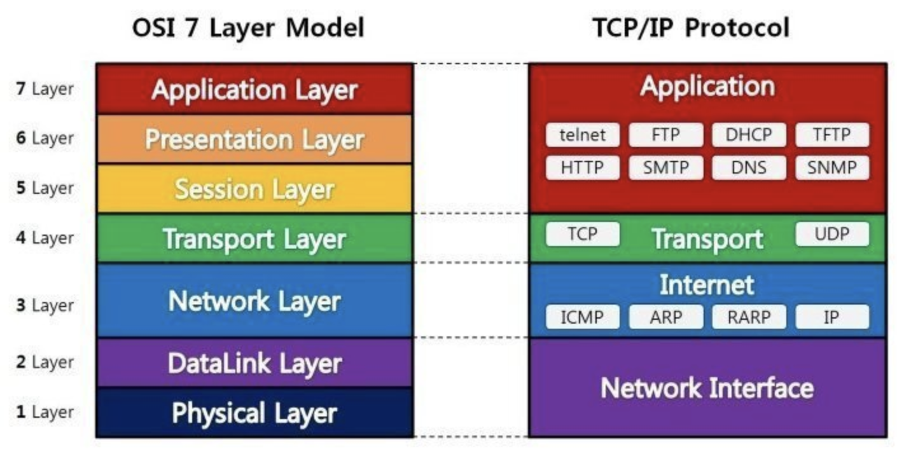
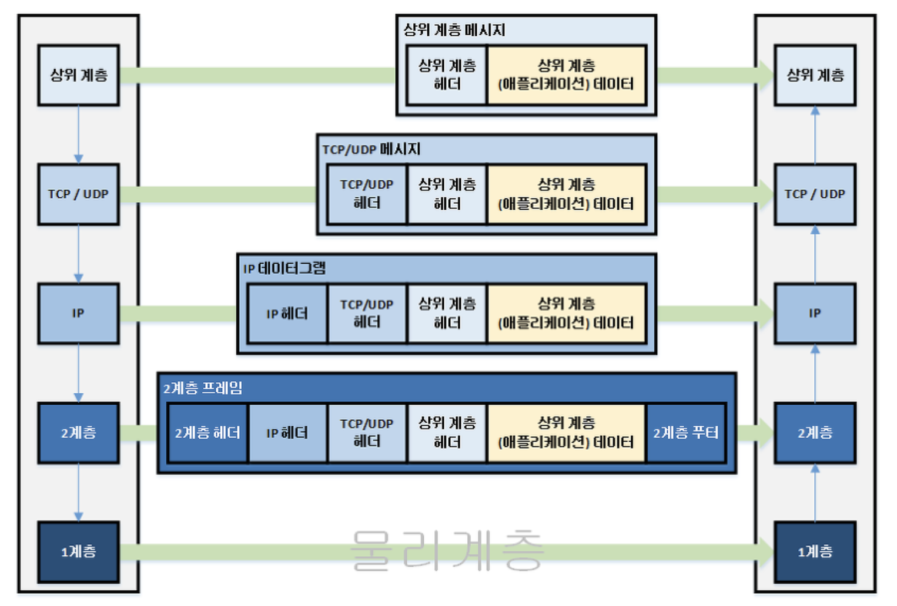

# What is Network, OSI 7 layer

## 네트워크란?

* net(그물)과 work의 합성어
* 그물처럼 서로 긴밀하게 연결된 것
* 컴퓨터 네트워크 : 컴퓨터 사이에 데이터를 주고 받는 통신망

## LAN (Local Area Network)

* 물리적으로 가까이 연결되어 있는 소규모 네트워크
* 비교적 간단하고 통신에 필요한 선이 짧아서 데이터를 주고 받을 때 오류가 적음
* 예) 집에서 공유기로 여러대의 컴퓨터를 연결

## WAN (Wide Aread Network)

* 지역이나 국가 등 넓은 영역을 연결하는 광역 네트워크
* 여러 곳에 흩어진 소규모 네트워크가 서로 통신할 수 있게 연결한 것. 즉, LAN과 LAN을 서로 연결한 것을 WAN이라 부르기도 함
* 개인이 구현하기 어려워서 ISP(Internet Service)가 회선을 설치하고 서비스를 제공함 (KT, SK브로드밴드, LG U+, ...)
* 인터넷도 WAN의 한 종류

## OSI 7계층

### 의미

* 네트워크에서 통신이 일어나는 과정을 7단계로 구분한 것
* Physical - DataLink - Network - Transport - Session - Presentation - Application

### 생겨난 이유

* 컴퓨터와 인터넷 사용이 늘어나면서, 다른 기종의 컴퓨터들 끼리도 네트워크 형성을 수월하게 하기 위해서 표준화하려는 움직임이 있었음
* 국제표준화기구(ISO)에서 1984년 개발한 모델, 통신이 일어나는 과정을 7단계로 구분함
* OSI는 개발 시스템 상호 연결(Open System Interconnection)을 의미함

### 역할

* 각 계층은 역할에 따라 나뉘고, 계층별로 통일된 규칙을 정의함
* 어떤 계층의 프로토콜을 달리해도, 계층별로 통일된 규칙이 있기 때문에 사용이 가능함
* 처음 보거나 새로 개발된 장치나 프로토콜도 빠르게 예측하고 이해하고 적용하기 용이함
* 모듈화가 잘 되어 있어서, 문제가 생기거나 업그레이드가 필요하면 그 부분만 바꾸면 됨

## TCP/IP 4계층

* OSI 7계층에 비해 이론보다 실용성에 중점을 둔 모델
* `internet protocol suite`라고도 함
* 각 계층에서 어떤 프로토콜이 필요한지를 정의한 프로토콜의 집합
* Network Interfacce - Internet - Transport - Application

## OSI 7게층 vs TCP/IP 4계층

<figure><figcaption></figcaption></figure>

&#x20;[그림 출처 : https://shlee0882.tistory.com/110](https://shlee0882.tistory.com/110)

| 분류    | OSI 모델                                   | TCP/IP모델                                  |
| ----- | ---------------------------------------- | ----------------------------------------- |
| 목적    | 다른 기종의 컴퓨터끼리도 네트워크를 형성할 수 있게 표준화, 호환성 준수 | 실제 컴퓨터들이 데이터를 주고 발들 수 있는 프로토콜을 만들어 실무에 적용 |
| 레이어 수 | 7계층                                      | 4계층                                       |
| 구성    | 역할 기반                                    | 프로토콜 기반                                   |
| 표준    | 이론적 표준                                   | 실무적 표준                                    |

## OSI모델로 보는 데이터 전송

### 데이터 전송 흐름

* 보내는 측 : 데이터가 응용계층에서 물리계층으로 내려감
* 물리계층의 선을 따라 받는 측으로 데이터가 전송됨
* 받는 측 : 물리계층으로 데이터를 받아 응용 계층으로 올라옴

### 데이터 전송 방식

* 캡슐화와 역캡슐화
* 캡슐화(encapsulation) : 보내는 측의 각 계층은 받는 쪽의 계층에 전달해야할 정보를 **헤더**에 담고, 하위 계층으로 전달함
*   역캡슐화(decapsulation) : 받는 쪽에서는 헤더 정보를 보고 처리한 뒤에, 자신의 계층에 속한 헤더 정보는 벗겨내고 상위 계층으로 전달함  [그림 출처 : https://ming9mon.tistory.com/11](https://ming9mon.tistory.com/11)

    <figure><figcaption></figcaption></figure>
