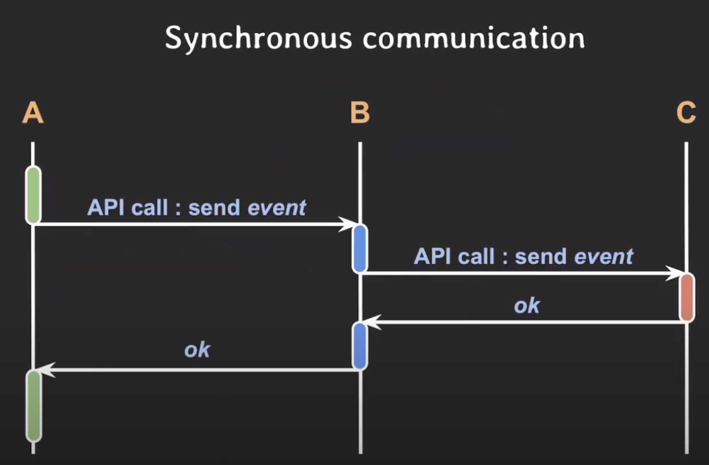

# Asynchronous

# 프로그래밍(programming) 관점에서의 asynchronous(비동기)
## synchronous(동기식)
- 하나의 작업이 끝나면 다음 작업을 함
- 여러 작업(task)들을 순차적으로 실행하도록 개발함
- 예)
	- 음식 준비하기 : 국 끓이고 다 끓이면, 햇반 데우고 다 데워지면, 스팸 굽기
	- 42 웹서브 : 하나의 요청에 대해 응답을 반환할 때까지 서버가 그 일만 함

## Asynchronous(비동기)
- 순차적으로 실행할 필요 없이 동시에 작업을 하는 것
- 여러 작업들을 독립적으로 실행하도록 개발함
- 예)
	- 음식 준비하기 : 국 끓이는 동안에, 햇반을 전자레인지 데우고, 데워지는 동안에 스팸 굽기
	- 42 웹서브 : 하나의 요청이 왔을 때, 다음 I/O 발생 전까지만 처리하고, 다른 요청의 I/O 이벤트 발생건을 처리함. 하나의 요청을 처리하는 과정이 순차적으로 되지 않고, 다른 요청과 동시에 처리함

## Synchronous vs Asynchronous

## 주의할 점
- asynchronous programming != multithreading
	- asynchronous programming : 여러 작업을 동시에 실행하는 프로그래밍 방법론
	- multi-threading : asynchronous programming의 한 종류

## asynchronous programming 가능하게 하는 방법
- multi-threads : 멀티코어를 활용할 수 있는 장점, 컨텍스트 스위칭 비용과 race condition 일어날 수 있는 단점
- non-block I/O : CPU 작업과 I/O 작업은 동시에 할 수 있는 작업이기에, 그 작업을 동시에 함
	- I/O device는 CPU역할을 하는 device controler가 있음. device controler가 장치에서 데이터를 I/O하고 있을 때, 컴퓨터의 CPU는 다른 일 할 수 있음 (진짜로 동시에 함)

  

# I/O관점에서 비동기
## 문맥에 따른 case 1
- synchronous I/O = block I/O
- asynchronous I/O = non-block I/O

## 문맥에 따른 case 2
- synchronous I/O : 요청자가 I/O 완료까지 챙겨야 할 때
- asynchronous I/O : 작업자가 OS로부터 작업 완료에 대해 noti를 받거나, 작업을 시작할 때 callback을 전달해서 작업이 끝날 때 OS가 알아서 callback을 실행

## 문맥에 따른 case 3
- asynchronous I/O : block I/O를 다른 thread에서 실행함
	- ASP.NET에서 async로 thread pool 사용하는게 이 경우일 듯

  

# 백엔드 아키텍처 관점 (a)synchronous communication
- 하나의 서비스는 기능과 역할에 따라 여러 개의 마이크로 서비스로 구성되고, 이들 사이에서는 빈번하게 커뮤니케이션이 발생함
## synchronous
- 각각의 마이크로 서비스가 커뮤니케이션 할 때, 한 마이크로 서비스가 다른 마이크로 서비스한테 이벤트를 주면, 그 이벤트가 처리될 때까지 기다렸다가 작업을 계속함
- 특정 마이크로 서비스에서 문제가 생기면, 다른 마이크로 서비스에게도 치명적인 영향을 주게 됨

## asynchronous
- Message Queue를 활용함
- 전달하고 싶은 이벤트가 있으면 message queue에 넣고 자기할일 함
- 각 마이크로 서비스는 다른 마이크로서비스랑 공유하는 message queue를 계속해서 살펴보고, 있으면 처리함
- 특정 마이크로 서비스에서 문제가 생겨도 다른 마이크로 서비스에게도 장애에 파급력이 약함

# 참고 및 그림 출처
- [유튜브 쉬운코드](https://youtu.be/EJNBLD3X2yg)
